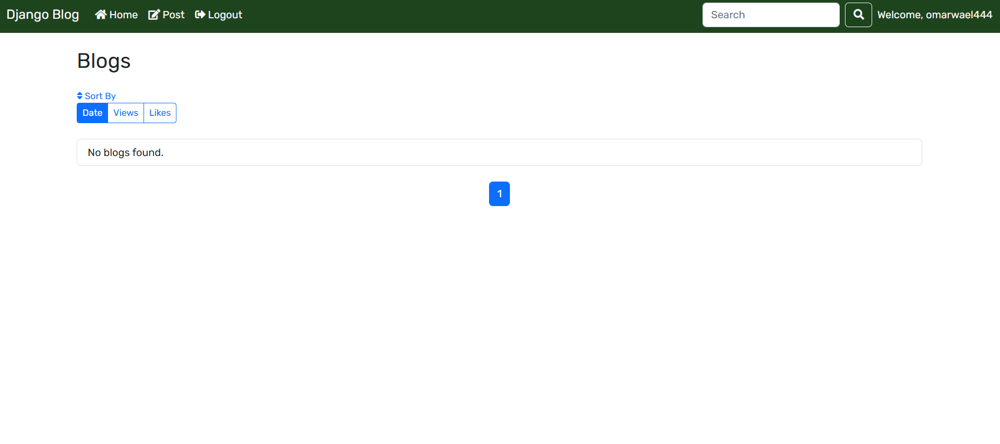
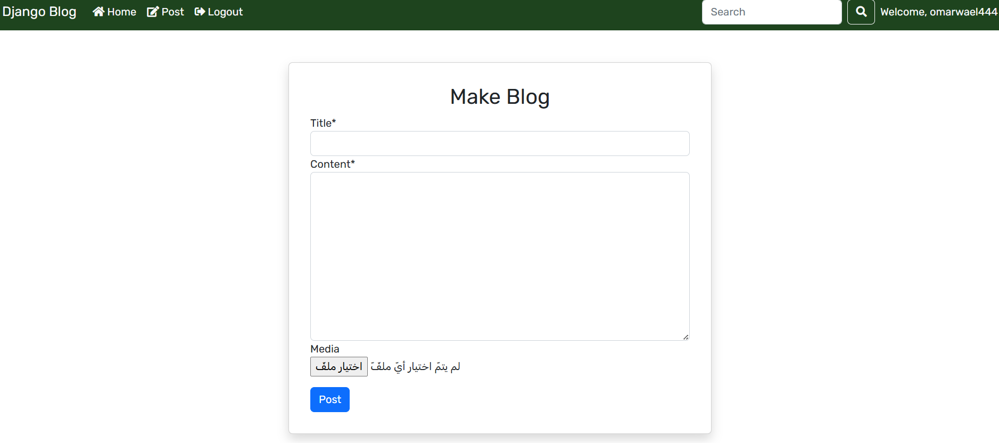
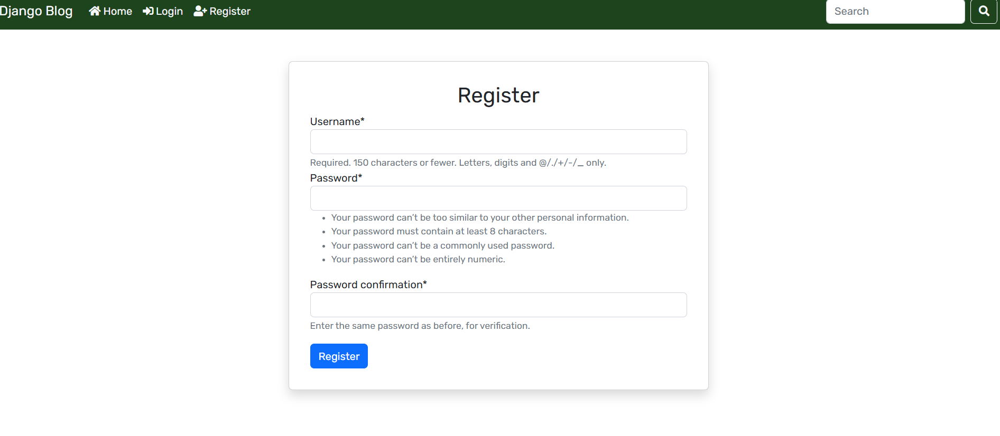

# Django Blog

Personal Blog project built with Django.

## Features
- User authentication (sign up, login, logout)
- Create, edit, delete posts
- REST API with Django REST Framework
- Crispy forms for better UI
- Image uploads using Pillow

## Tech Stack
- Python 3.11
- Django 4.2
- Django REST Framework
- Pillow
- Bootstrap / CSS

## Screenshots

### Home Page

### Post Detail

### Register Page


### login page


> استبدل `path_to_your_screenshot/...` بالمسار الفعلي للصور داخل مشروعك.

## Setup & Installation

### 1. Clone the repo
```bash
git clone https://github.com/omarwael5556666-stack/omar-blog.git
cd omar-blog
2. Create a virtual environment
bash
Copy code
python -m venv env
3. Activate the environment
Windows:

bash
Copy code
env\Scripts\activate
Mac/Linux:

bash
Copy code
source env/bin/activate
4. Install dependencies
bash
Copy code
pip install -r requirements.txt
5. Apply migrations
bash
Copy code
python manage.py migrate
6. Start the development server
bash
Copy code
python manage.py runserver
Open your browser at http://127.0.0.1:8000/ to view the blog.

API Endpoints
List Posts: /api/posts/

Retrieve Post: /api/posts/<id>/

Create Post: /api/posts/create/

Update Post: /api/posts/<id>/update/

Delete Post: /api/posts/<id>/delete/


